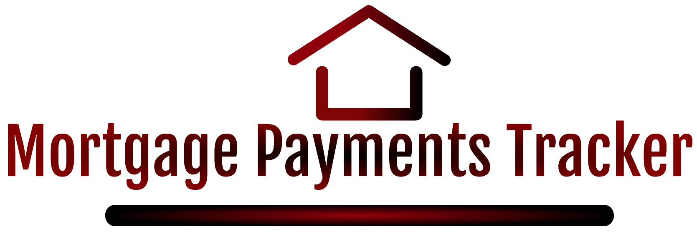
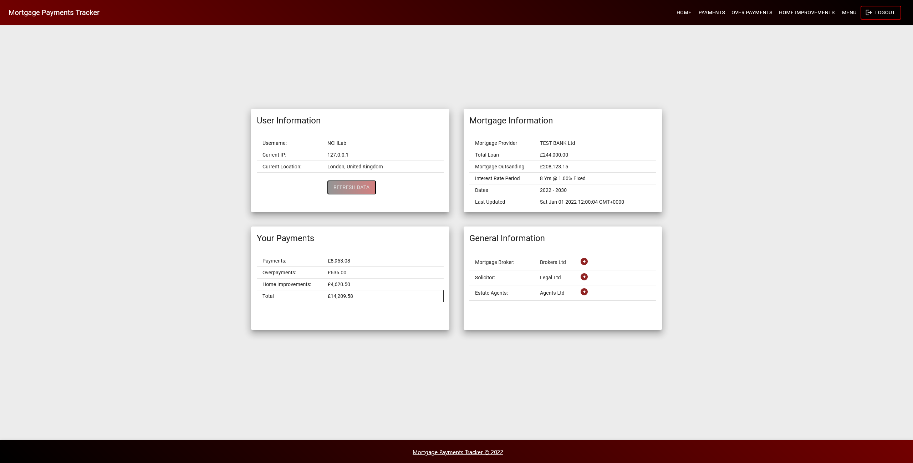
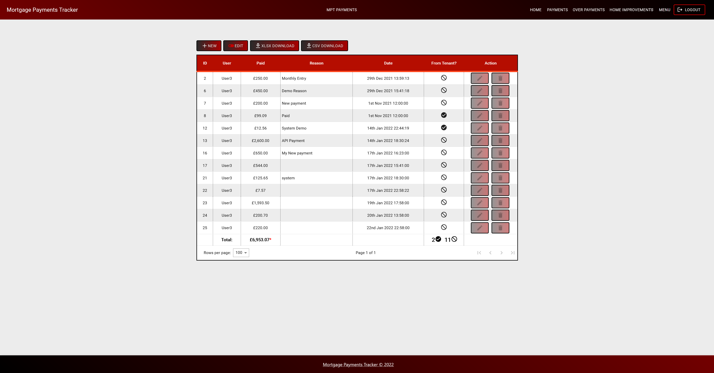
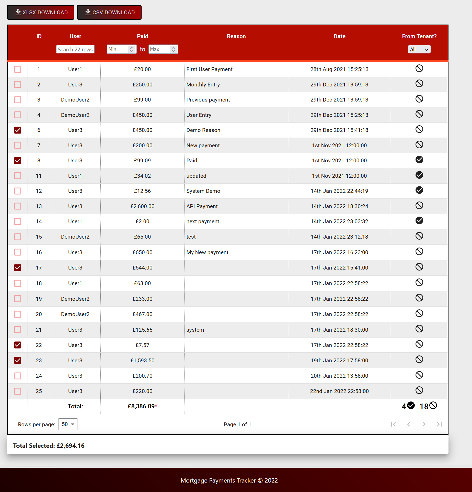

# Mortgage Payments Tracker GUI

   

Welcome to the Mortgage Payments Tracker (MPT). This is the frontend for the website and requires the associated [MPT API](https://github.com/NCHlab/Mortgage_Payments_Tracker_API) to function.

> Note: Due to specific considerations, an instance of this server + API can only be used by 1 set of people who know each other. This is due to data on some pages being shared for all users (this project has a specific case for me - which is obvious by its name), thus adding in features for gobal public use has not been done.

Demo Access can be found on: [demo.nayamc.com/mortgage](demo.nayamc.com/mortgage)

This website allows a user to track how much they have paid towards their mortgage, as well as being able to see payments made by others to the same mortgage.

Features such as adding / editing / deleting payments allows you to modify payment information across 3 different pages: `Payments`, `Overpayments`, `Home Improvements`. These pages also allow a user to download either an EXCEL or CSV file for each page.

A `logs` page exists for auditing payments and seeing changes. Logs can be viewed as JSON or as a table.

A `totals` page also exists which shows condensed payment information about all users as well as allowing a user to download all payment information into an EXCEL file.

Some examples of pages are below:

### Homepage (Logged in)

### Payments page

### All Payments page Table

